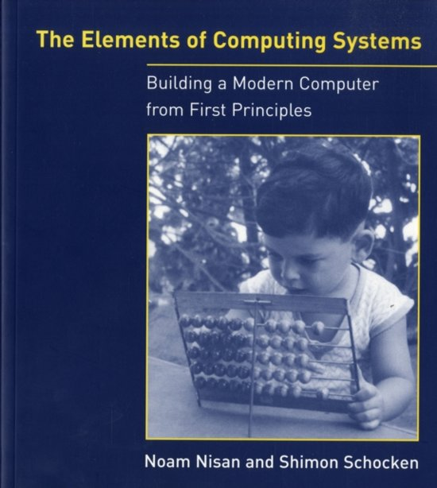

# nand2tetirs
Building a  Modern Computer, "The Elements of Computing Systems - Noam Nisan and Shimon Schocken"  with Coursera  

  
Coursera : https://www.coursera.org/learn/build-a-computer/home/welcome  
